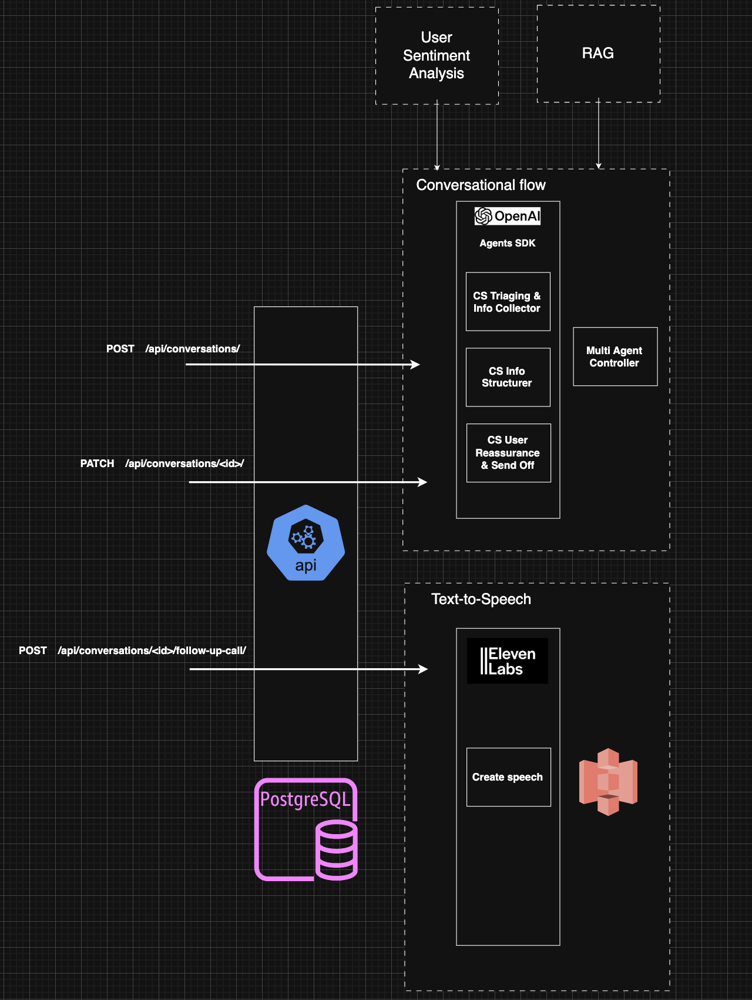
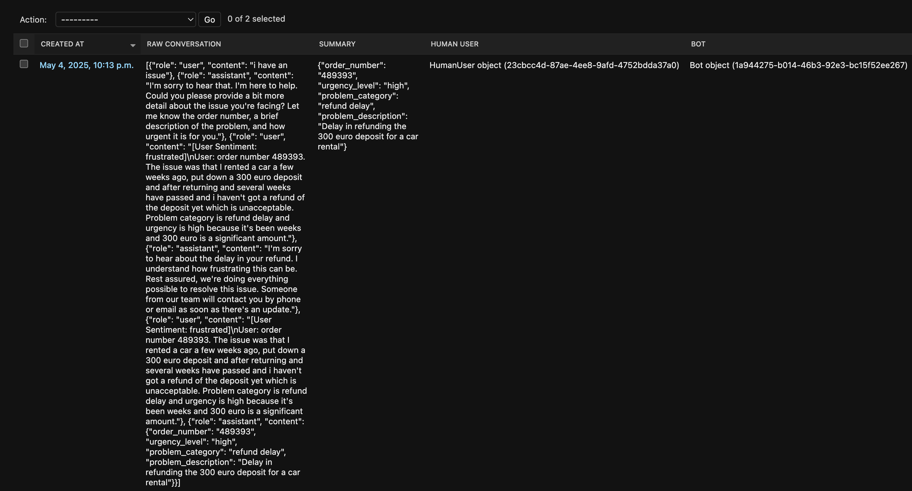

# conversational-agent

## Setup instructions

Note: an environment variable OPENAPI_API_KEY with a valid API key for the OpenAI API platform is necessary.

- Run command:
```
make recreate
```

- Run tests:
```
make test
```

## Create a conversation with the Customer Support of the fictional business

- Create a conversation.

Note: The only valid functions is customer_support, but only customer_support

```
curl -X POST http://localhost:8001/api/conversations/ \
  -H "Content-Type: application/json" \
  -d '{"function": "customer_support"}'
```

It should return a response like:
```
{
"conversation_id":"9701444a-9618-428c-9a24-eca0636fbc9d",
"bot_id":"1e575937-32a4-4ffe-b09f-48a95dbedc91",
"human_user_id":"8c37b9b4-4c6f-4702-9f84-57d5cbbf81f8"
}
```

- A human user can make a comment to the Customer Support in the context of a conversation/issue using
a request like below with the conversation_id returned in the previous request:

```
curl -X PATCH http://localhost:8001/api/conversations/9701444a-9618-428c-9a24-eca0636fbc9d/ \
  -H "Content-Type: application/json" \
  -d '{"message": "i have an issue"}'
```

It should return a response like below following certain pre-configured instructions and the conversation
history up to that point in the conversation:
```
{
"bot_message": "I'm here to help! Could you please provide me with a bit more information? Let me know your order number, the category of the problem, a brief description of the issue, and how urgent it is. That way, I can assist you better!"
}
```

## System architecture overview

### Diagram



### Domain modelling:
- The Intelligent Conversational Agent application was split in 4 domains: conversations, bots,
human users and prompts. Since Django was used, 4 applications were created so the 4 domains can
evolve somehow independently although some of them are related to each other mainly through FK
relations in DB.


## Explanation of key design decisions

- Structure output from agents based on LLMs. LLM produce natural language and, unless specific instructions are
given to it and features of the AI platform are used (specific prompt instructions, tools, output type),
doesn't abide by the instructions by default.
- The agents, at least on OpenAI agents framework, have to be coordinated it so the right agent is used
to give an answer even if the handoffs feature is used. That's the reason why a multi-agent controller
was added.
- Postgres and storing conversation and extracted data in JSON
- Using OpenAI Agents SDK for conversation flow.
- Async use in PATCH /api/conversations/<id>/ endpoint because Runner.run is async. I realized later there is
a Runner.run_sync so making the endpoint async maybe was not 100% necessary.
- 

## Description of potential improvements
- Store conversations as the product scales. Postgres JSONB field allows max size 1 GB.
https://www.dbvis.com/thetable/everything-you-need-to-know-about-the-postgres-jsonb-data-type/#:~:text=What%20is%20the%20size%20limit,text%20%2C%20which%20is%201%20GB.

- It makes sense to have a model HumanUser but probably it shouldn't be part of this agent service.


## Sample conversations demonstrating the bot's capabilities

- Sample conversation between the Customer Support agent and a human user:

Note: the raw_conversation field is a list and the messages order is the lower the index in the list the earlier the message

