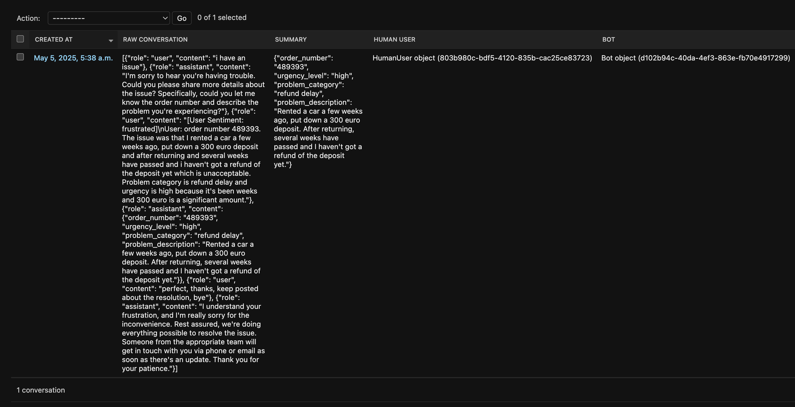
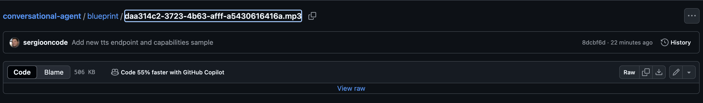

# conversational-agent

## Setup instructions

Note: an environment variable OPENAPI_API_KEY with a valid API key for the OpenAI API platform is necessary. Also an
environment variable ELEVEN_LABS_API_KEY is necessary to use Text-to-Speech on the
`/api/conversations/<conversation_id>/follow-up-speech/` endpoint. They can be added in file .env.local after creating
the file with `touch .env.local`

Note: there is a `How to test` section with cURL commands to test.

- Run command:
```
make recreate
```

- Run tests:
```
make test
```

## System architecture overview

- As the diagram in the following subsection below shows, the Conversational agent service is exposed through a REST API.

- There are 2 sets of endpoints corresponding to 2 different flows: Conversational and Text-to-speech flows.

- In the Conversational flow there is an endpoint to create a conversation between a human user and a bot, and
an endpoint to send/add a message to a conversation which returns a response from the bot. This flow relies
on the OpenAI API platform accessed through the Agents SDK.

- The Conversational flow relies on a 3 agent architecture. Since the Customer Support is the use case the agents
defined are: `Customer Support Triaging and Info Collector`, `Customer Support Info Structurer` and
`Customer Support User Reassurance and Send Off`

- In the TTS flow there is only one endpoint to create a speech recording with a follow-up to a given conversation
for which a summary should exist. The recording file currently is saved in the local file system (but it could be
changed to an S3 bucket in a following iteration). This flow relies on the ElevenLabs API accessed through its Python client.

- This TTS flow is not fully defined since a user could only listen to the recording but nothing else like for example
reply with a question. The recording is generated given a text based on the summary of the conversation and a static template
which is very limited. More definition on the exact use case would be necessary and
further development needed and maybe a proper call with a TTS agent could set be up.

- The conversations as the human user sends messages and the agent answers are stored in PostgreSQL.
When the human user provides all the info required by `Customer Support Triaging and Info Collector` the summary
is extracted by the agent `Customer Support Info Structurer` using the `tools` feature of OpenAI Agents
SDK. The summary is saved in a JSON field called `summary` as part of the conversation model instance.

### Diagram


### Domain modelling:

- The Conversational agent service was split in 4 domains: conversations, bots,
human users and prompts. Since Django was used, 4 applications were created so the 4 domains can
evolve somehow independently although some of them are related to each other mainly through FK
relations in DB.


## Explanation of key design decisions

- The Conversational agent service is anchored in the Customer Support use case which can be seen
in prompts and architecture of agents.

- Using OpenAI Agents SDK for conversation flow was a decision made based on some research where some
sources praised the OpenAI and the LLM model `gpt-4o` specifically for the Customer Support use case. I debated with 
myself between OpenAI and Anthropic platforms and I landed on OpenAI also because both the Agents SDK official
docs and the examples in the official OpenAI repo caught my eye for the good.

- The OpenAI Agents SDK seems to be evolving and its documentation with it.
Also it seems that they used to have something called `agentkit` as part of the SDK and some examples online
reference it but it's not in the official docs which caused a bit of confusion during development.

- Getting structured output as a response from agents based on LLM is not a trivial thing to accomplish. LLMs produce natural language 
and, unless specific instructions are given to the model and features of the AI platform are used (specific prompt
instructions, and in the case of OpenAI Agents SDK tools and output type), the model doesn't 100% abide by the
instructions given in the instructions/prompt.

- The agents, at least on the OpenAI agents framework, are stateless. The handoffs feature in the SDK is slightly misleading
because it sounds as if the agents coordinate themselves and hand off tasks to other agents but it's not 100% like that.
The consequence of the above is that they have to be
coordinated so the right agent is used to give an answer even if the handoffs feature is used. That's the reason
why a multi-agent controller was added towards the end of the development although it needs more testing.

- Regarding the context and memory of the agents, the whole conversation history up to the point when the service gets a new message from the user
is currently passed as input, together with the received user message, to the agent that runs to generate an answer. That conversation history is formatted
in a structured way like a string `User: <message>\nAssistant: <message>...`. That history string that is passed to the agents is
generated in reverse order with the earlier messages being at the end of that string. In the prompts for the 3 agents
is indicated that the conversation history is part of the input they receive so the agent can rely on it.

- The agent `Customer Support Triaging and Info Collector` which is the first to run already receives the
whole conversation history.

- I use Postgres to store conversation messages in a JSONB field, the field is called `raw_conversation` and it has a list
as default so as the application runs messages are appended. After doing some research that append of an item which
is such like `{"user": "<message>", "assistant": "<message>"}` seems to be efficient from a performance point of
view. Also the JSONB field has a max size that seems high enough (1 GB).

- Async is used in PATCH `/api/conversations/<id>/` endpoint because `Runner.run` is async. I realized later there is
a Runner.run_sync so making the endpoint async maybe was not 100% necessary.

### Bonus points

- Sentiment analysis detection was added in a very simplistic way by just trying to find sentiment keywords
(frustrated, dissapointed, etc) in customer messages and enriching that message with the
sentiment information as a label in structured format like [User Sentiment: highly frustrated]... + message.

- I started working on RAG to improve the agent system answers. On Kaggle I found a knowledge base with customer
support answers from accounts on X. I researched a "cheap" way to implement RAG using an Open Source LLM model and loading
the embeddings in memory.

- The RAG service would compare the user's comment with embeddings of
the answers in the mentioned knowledge base using a simple LLM model called `all-MiniLM-L6-v2`. A RAG service could be
developed which would load answers embeddings in memory (in the future a Vector DB could be
used), then the `ConversationPartialUpdateManager` would call that RAG service.

- The implementation of multi turn memory was not done but the building blocks which are
conversation history passed to each agent and proper multi agent routing are in place.

- In order to implement multiple language support the language used in the user message should be detected
using Python package like `langdetect` or similar. Beforehand in the instructions/prompt of all agents
a line like `If the user speaks French. Always respond in French.` (and same way for all languages supported) should
be added and then for each user message a structured label like `[User Language: French]` or similar should be injected
in the input to `Runner.run` of the agent.


## Description of potential improvements

- Storing conversations as the product scales. Postgres JSONB field which allows max size 1 GB but probably
older conversations could be offloaded to a more cost-effective storage like S3.

- The API has no authentication and that's not right. It should be first identified who is the
user and who is the client of the API, whoever owns the authentication method artifact (API key, token, etc)
will be the client since through that authentication method we know is an authenticated client of the API.

- I had plans for the Prompt Django model but it's currently not used. The prompts for the 3-agent system are mainly static.
If the prompts were to be generated dynamically maybe the Prompt Django model could come in handy. 

- Increasing the test coverage would be necessary.

## How to test

- Create a conversation with the Customer Support of the fictional business.

Note: The only valid functions is customer_support, but only customer_support

```
curl -X POST http://localhost:8001/api/conversations/ \
  -H "Content-Type: application/json" \
  -d '{"function": "customer_support"}'
```

It should return a response like:
```
{
"conversation_id":"9701444a-9618-428c-9a24-eca0636fbc9d",
"bot_id":"1e575937-32a4-4ffe-b09f-48a95dbedc91",
"human_user_id":"8c37b9b4-4c6f-4702-9f84-57d5cbbf81f8"
}
```

- A human user can make a comment to the Customer Support in the context of a conversation/issue using
a request like below with the conversation_id returned in the previous request:

```
curl -X PATCH http://localhost:8001/api/conversations/9701444a-9618-428c-9a24-eca0636fbc9d/ \
  -H "Content-Type: application/json" \
  -d '{"message": "i have an issue"}'
```

It returns a response like below following certain pre-configured instructions and the conversation
history up to that point in the conversation:
```
{
"bot_message": "I'm here to help! Could you please provide me with a bit more information? Let me know your order number, the category of the problem, a brief description of the issue, and how urgent it is. That way, I can assist you better!"
}
```

- A human user can request a follow up call (a speech recording for now) on a conversation previously
created:

```
curl -X POST http://localhost:8001/api/conversations/9701444a-9618-428c-9a24-eca0636fbc9d/follow-up-speech/
```

It returns a speech recording id containing a follow up speech on the conversation whose id is passed,
the actual recording file is saved in the `resources` folder at the top level from where
it can be played:

```
{
"speech_id": "a84ba83d-b27e-43d5-9706-cfac53ea37bc"
}
```

## Sample conversations demonstrating the bot's capabilities

- Sample conversation between the Customer Support agent and a human user:

Note: the raw_conversation field is a list and the messages order is the lower the index in the list the earlier the message



- Sample text to speech

Click [here](https://github.com/sergiooncode/conversational-agent/blob/main/blueprint/daa314c2-3723-4b63-afff-a5430616416a.mp3)
to download the raw file which then can be played on your computer. To download click on the arrow down button on
the far right seen below:




